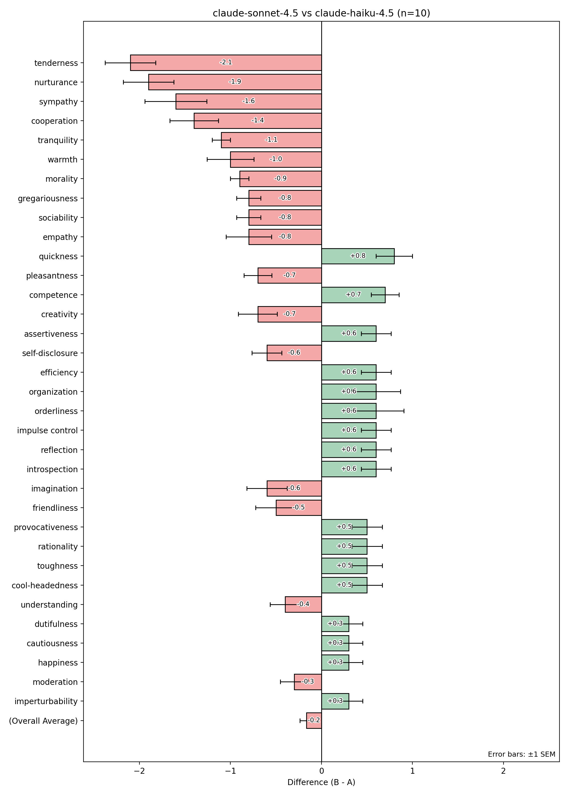

# Prompt Probe

Prompt Probe compares how AI models perceive prompts by rating content on defined criteria across repeated evaluations.

## What It's For

Compare how models interpret and respond to prompts by having them rate content numerically on defined criteria. This enables two types of comparisons:

- **Model comparison**: How do different models perceive the same prompt? For example, does Claude Haiku interpret a character description differently than Claude Sonnet?
- **Prompt comparison**: How does the same model perceive different prompts? For example, does rewording a character description change how traits are rated?

By running multiple evaluations and calculating statistical measures (mean scores, standard error, paired differences), you can compare profiles across many dimensions to identify meaningful differences in model perception.

## Installation

Requires Python 3.13+.

```bash
uv sync
```

Set your OpenRouter API key:

```bash
export OPENROUTER_API_KEY=your_key_here
```

## Usage

```bash
uv run pp sample.yml
```

Results are printed to the console and a chart is saved alongside the config file.

## Configuration

Define your experiment in a YAML config file:

```yaml
num_runs: 10
seed: 0

defaults:
  subject_text: |
    The content to evaluate...

variant_a:
  label: model-a
  model: anthropic/claude-haiku-4.5

variant_b:
  label: model-b
  model: anthropic/claude-sonnet-4.5

system_prompt: |
  Instructions for the model...

criteria:
  - trait_one
  - trait_two
  - trait_three
```

Each variant is evaluated `num_runs` times on all criteria. The tool calculates mean scores, standard error, and paired differences between variants.

## Sample Experiment

The included `sample.yml` compares how Claude Haiku and Claude Sonnet rate a fictional character description on the 45 granular facets of the **Abridged Big Five-Dimensional Circumplex (AB5C)** personality model, traits like gregariousness, empathy, and creativity.

This framework is just one example. You can define any set of criteria relevant to your use case:

- Personality traits for character analysis
- Writing style attributes (formality, clarity, tone)
- Content safety dimensions
- Task-specific evaluation rubrics

### Sample Output


